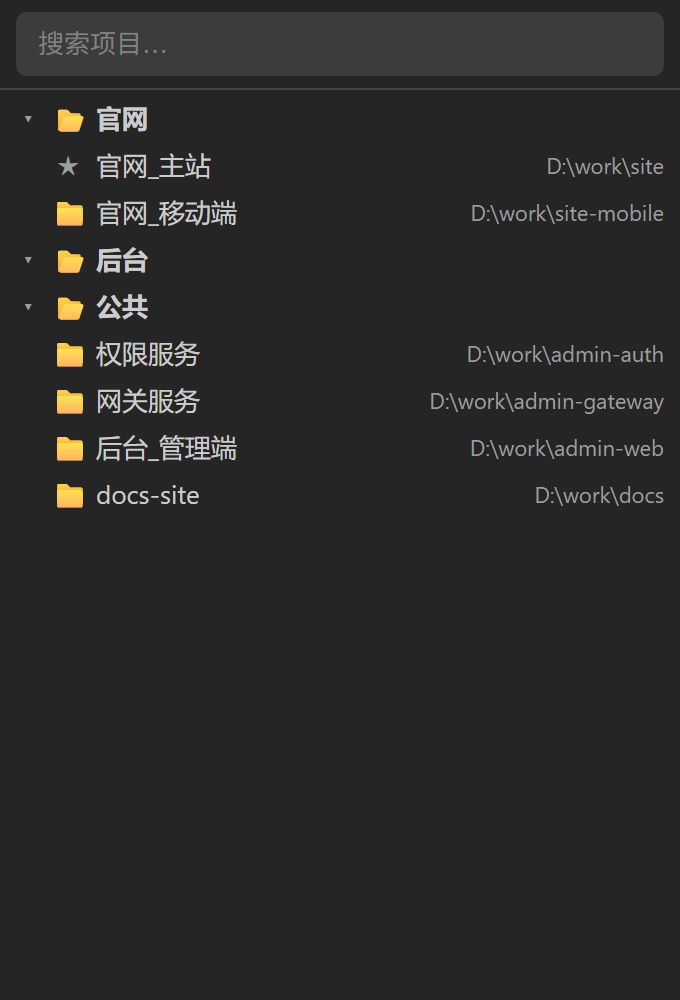
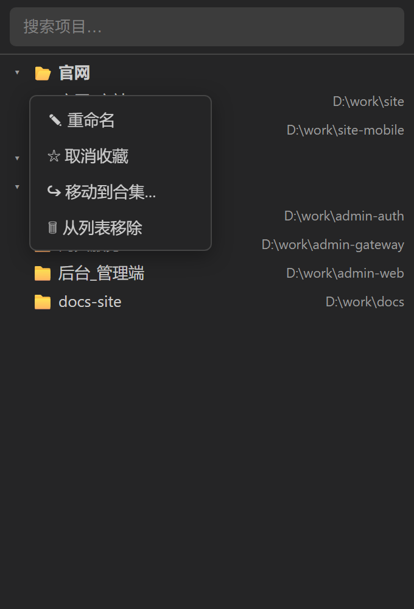

# 项目列表 (Project List)

像 WebStorm 一样的项目列表：VS Code 左侧常驻的项目启动器。把常用项目集中在一处，分合集管理、拖拽归类、起别名、收藏置顶，点一下就能打开。

> A persistent project launcher for VS Code: keep all your projects in one sidebar, organise them into nested collections, drag to reorder or file them away, rename them, and open any project with a single click. The UI is currently in Chinese.



## 功能

- **合集（文件夹）**：把项目分门别类放进合集，例如「后台」「官网」；合集支持任意层级嵌套，点击合集行即可折叠/展开。
- **排序**：默认保持**添加时的先后**，拖拽即可调整（位置会被记住）；收藏（★）的固定排在最上面一组。合集内每个层级独立排序。
- **重命名**：给项目起自定义名称，已重命名的项目自动排在前面；打开后窗口顶部标题显示别名。
- **快速打开**：点击任意项目即可打开，鼠标中键在新窗口打开；支持 `.code-workspace` 工作区文件。
- **搜索**：顶部搜索框按名称/路径实时过滤项目。
- **拖拽**：同级拖动改顺序；把项目拖到合集行上即**直接归类**（拖到别的合集里的项目上也会跟着移进去），把合集拖到别的合集上即**直接嵌套**。
- **收藏**：把常用项目固定到列表最上方，右键按当前状态显示「收藏」或「取消收藏」。
- **本地配置**：列表保存在 `~/.vscode-project-list.json`，可手动编辑、可跨窗口同步（点 ⟳ 刷新即可拉到别的窗口的改动）。

## 使用

1. 点击左侧活动栏的**项目列表**图标。
2. 点右上角 **＋** 从磁盘选择目录，或按 `Ctrl+Shift+P` 执行「项目列表: 添加当前项目」。
3. 点右上角**新建合集**（或 `Ctrl+Shift+P` →「项目列表: 新建合集」）建一个合集。
4. **点击**项目行打开项目；**点击**合集行折叠/展开。
5. **拖动**项目行到合集上即可归类（松开即生效），同级拖动即可排序（搜索过滤状态下会禁用拖拽）。
6. **右键**项目行可：**重命名** / **收藏**（已收藏时显示**取消收藏**） / **移动到合集…** / **从列表移除**。
7. **右键**合集行可：**新建子合集** / **重命名合集** / **移动到合集…** / **删除合集**（删除合集不会删项目，项目会上移到上一层）。
8. 顶部搜索框输入关键字即可过滤；**＋／📁／⟳／⚙** 在标题栏右侧。



想「双击启动 VS Code 直接进入项目列表」，在 `settings.json` 里加 `"window.restoreWindows": "none"`。

## 安装

- **扩展市场**：在 VS Code 扩展面板搜索「项目列表」或 `project-list-sidebar`。
- **离线 VSIX**：从 [Releases](https://github.com/fujunx/project-list-sidebar/releases) 下载 `.vsix`，然后 `Ctrl+Shift+P` → **Extensions: Install from VSIX...**。
- **命令行**：`code --install-extension project-list-sidebar-*.vsix`

要求 VS Code 1.85 及以上。

## 设置

| 设置 | 默认 | 说明 |
| --- | --- | --- |
| `projectList.showOnStartup` | `true` | 启动时若没有打开任何文件夹，自动把侧边栏切到「项目列表」（适合把 VS Code 当项目启动器用；打开着项目的窗口不受影响）。不想被自动切换就关掉它。 |
| `projectList.preferNamedFirst` | `true` | 已重命名的项目排在前面 |
| `projectList.configPath` | `~/.vscode-project-list.json` | 列表配置文件路径，支持 `~` |

配置文件里 `collections` 描述合集（`id` / `name` / `parentId` / `order`），项目用 `collectionId` 指向所属合集（`parentId`、`collectionId` 为空表示顶层）；项目的顺序由 `order`（拖拽结果）决定，没拖拽过的按 `addedAt`（添加时间）先后排列。

## 常见问题

- **启动时侧边栏被自动切走了**：把 `projectList.showOnStartup` 设为 `false`。
- **为带别名的项目生成的 `.code-workspace` 在哪**：本扩展全局存储目录下的 `project-workspaces/`（Windows `%APPDATA%\Code\User\globalStorage\fujunx.project-list-sidebar\`；macOS `~/Library/Application Support/Code/User/globalStorage/fujunx.project-list-sidebar/`；Linux `~/.config/Code/User/globalStorage/fujunx.project-list-sidebar/`），不会写进你的项目目录，也不会写进主目录。
- **项目路径不存在了**：点击该项目会弹提示，可直接「从列表移除」。

## 开发

```bash
npm install
npm run compile   # 编译到 dist/
npm run watch     # 监听
npm run typecheck # 类型检查
npm run vsix      # 打包 .vsix
```

`scripts/` 下有两个一次性资源生成脚本（Windows 专用，产物已提交，构建流程不需要）：

- `make-icon.ps1` —— 生成商店图标 `media/icon.png`（复用活动栏图标 `media/projects.svg` 的轮廓）。
- `make-screenshots.ps1` —— 用**真实的 webview HTML**（`npm run compile` 后）渲染 `docs/images/` 里的截图，配 VS Code 深色主题变量。需要 PowerShell 7+ （`pwsh`）。

## 发布新版本

`npm run release` 会**自动递增版本号并打包**（`0.0.1 → 0.0.2`，patch 满 9 进位到 minor），但**不推送**。若有功能改动，顺手把 `CHANGELOG.md` 顶部的 `Unreleased` 改成新版本号：

```bash
npm run release                                # 递增版本 + 打包（不推送）
git add -A && git commit -m "chore: 发布 vx.y.z"
git tag vx.y.z                                 # 打标签
git push origin main --tags                     # 推送（触发 Actions 建 Release）
```

推送 `v*` 标签后，GitHub Actions 会自动打包并把 `.vsix` 挂到 Release 上。

## 更新日志

见 [CHANGELOG.md](CHANGELOG.md)。

## 许可

[MIT](LICENSE)
